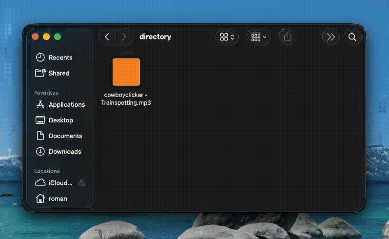

# scdl

A simple command-line & library downloader for SoundCloud tracks written in Go.



## Installation

```bash
go install github.com/hellsontime/scdl/cmd/scdl@latest
```

Or build from source:

```bash
go build -o scdl cmd/scdl/main.go
```
or 
```bash
make build-os-arch
```

## Usage

```bash
scdl <soundcloud-url> [options]
```

### Options

- `-o, --output`: Specify the output directory (defaults to current directory).
- `-a, --author`: Override artist/author name.
- `-n, --name`: Override track title.

## Examples

Download to the current directory:

```bash
scdl https://soundcloud.com/cowboyclicker/stay
```

Download to a specific directory:

```bash
scdl https://soundcloud.com/cowboyclicker/stay --output ~/Music/
```

Download with custom artist and track name:

```bash
scdl https://soundcloud.com/cowboyclicker/stay --author "Custom Artist" --name "Custom Title"
```

## Library Usage

### Installation

```bash
go get github.com/hellsontime/scdl
```

### Simple Usage

```go
import (
    "context"
    "github.com/hellsontime/scdl"
)

// ...

ctx := context.Background()

client, err := scdl.NewClient(ctx)
if err != nil {
    return err
}

// Fetch track metadata
track, err := client.GetTrack(ctx, "https://soundcloud.com/cowboyclicker/stay")
if err != nil {
    return err
}

// Optionally override artist/title before downloading
track.Artist = "Custom Artist"
track.Title = "Custom Title"

// Download the track to the current directory
path, err := client.Download(ctx, track, ".", nil) // progress callback is optional
if err != nil {
    return err
}
```
